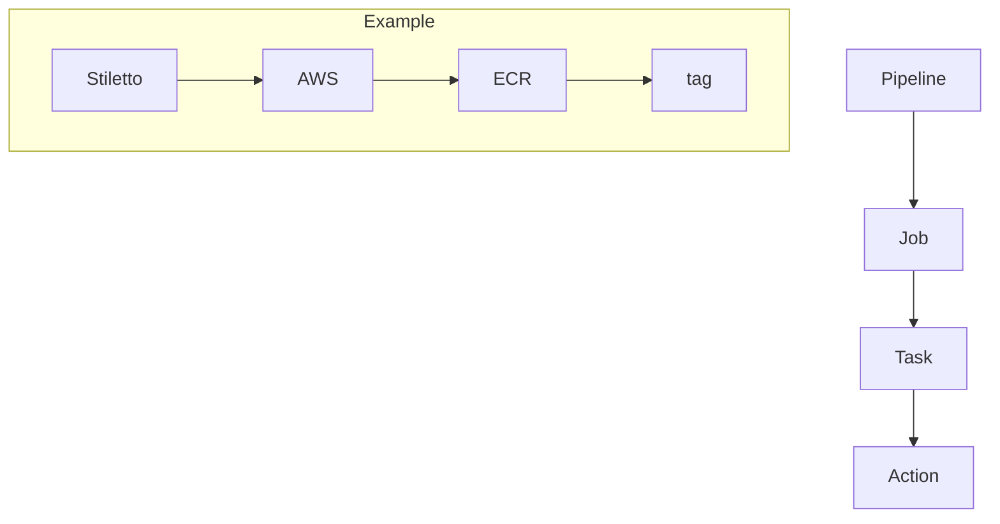

<h1 align="center">
  Stiletto ⚔️
</h1>

Portable, and <b>containerized</b> pipelines that runs everywhere! <b> works on top of Dagger ❤️️</b>.  

---
  

---
Stiletto (means "dagger" in Italian) is a portable, and containerized pipelines that runs everywhere, since it works on top of the wonderful
[Dagger](https://dagger.io). Its main motivation is to provide a simple way to run pipelines in a portable way, and also to provide a way to run
pipelines in a containerized way, so you can run your pipelines in any environment, and also in any CI/CD platform.
Stiletto follows the same principles as [GitHub Actions](https://github.com/features/actions) in the way that it defines a pipeline, its jobs and actions; nevertheless, **it's not a 'portable' version of GH actions**.

## Roadmap 🗓️

There are more things to do, however, the following are the main ones:

- [ ] Use an alternative `stiletto-pipeline.yml` file to define the pipeline, its jobs and actions.
- [ ] Add some tests.
- [ ] Add an official DockerFile that can be available in [DockerHub](https://hub.docker.com/).
- [ ] Refactor it to allow 'Stiletto' to be used as a library.
- [ ] Refactor it to allow 'Stiletto' to be used as an API (e.g. to be used in a CI/CD platform).

>**Note**: This is still work in progress, however, I'll be happy to receive any feedback or contribution. Ensure you've read the [contributing guide](./CONTRIBUTING.md) before doing so.

## Contributing

Please read our [contributing guide](./CONTRIBUTING.md).

## Community

Find me in:

- 📧 [Email](mailto:alex@ideaup.cl)
- 🧳 [Linkedin](https://www.linkedin.com/in/alextorresruiz/)

